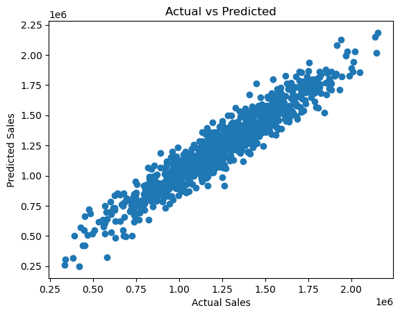

# House-Price-Prediction
A Machine Learning project for predicting house prices in the USA using Linear Regression

House Price Prediction – Linear Regression
This project applies Linear Regression on the [USA Housing dataset] to predict house prices based on several numerical features such as average income, house age, and number of rooms.

📌 Project Overview

The main goal of this project is to:

Explore and clean the dataset.

Detect and handle outliers.

Scale features using StandardScaler.

Train and evaluate a Linear Regression model.

Visualize the relationship between actual and predicted house prices.

📂 Dataset

The dataset contains the following features:

Avg. Area Income – Average income of the area’s residents.

Avg. Area House Age – Average age of houses in the area.

Avg. Area Number of Rooms – Average number of rooms per house.

Avg. Area Number of Bedrooms – Average number of bedrooms per house.

Area Population – Population of the area.

Price – Target variable (house price).

Address – Dropped as it’s categorical and not relevant for prediction.

Technologies Used
- Python 🐍
- pandas, numpy
- matplotlib, seaborn
- scikit-learn

🛠️ Steps in the Project

Data Exploration

Displayed info, description, null values, and duplicates.

Dropped unnecessary column (Address).

EDA (Exploratory Data Analysis)

Correlation heatmap.

Scatter plots and pair plots.

Boxplots for outlier detection.

Outlier Handling

Used the IQR method with threshold = 1.5 to remove outliers.

Data Preprocessing

Train/test split (80/20).

Feature scaling using StandardScaler.

Model Training

Applied Linear Regression from sklearn.

Model Evaluation

Mean Absolute Error (MAE): ~ 81,309

Mean Squared Error (MSE): ~ 10,116,760,189

Visualization of Actual vs Predicted prices 

